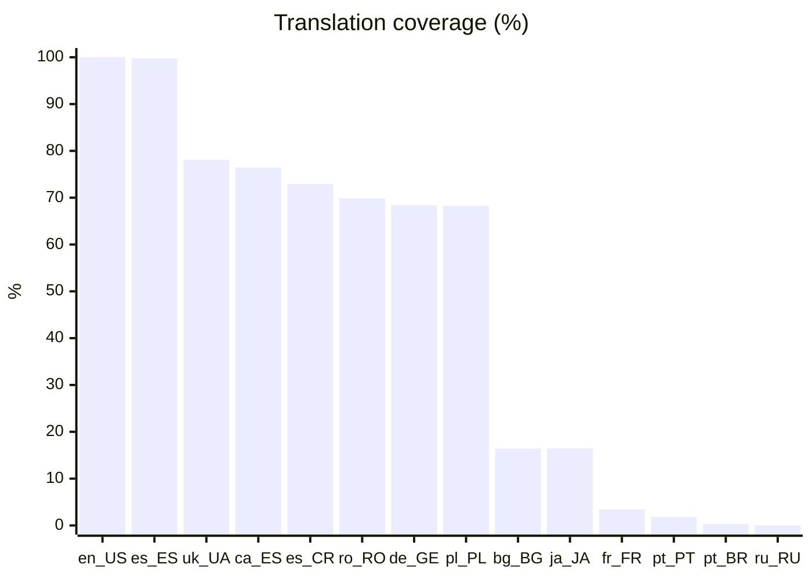

# Giswater translations

Versioned language packs for the [Giswater QGIS plugin](https://github.com/giswater/plugin).

This repository is an artifact dump, not source. The plugin downloads `translations_{locale}.zip` from here (Manage Languages). `en_US` is bundled in the plugin; every other locale comes from these packs. Coverage numbers and this README are regenerated by the plugin CI (`i18n_generate.yml`).

## Layout

| Path | What |
| --- | --- |
| `latest/` | Current packs plus `languages.json` and `translations.json` |
| `4/{minor}/{patch}/` | Snapshot published with plugin version `4.Y.Z` |
| `versions.json` | List of published `X.Y.Z` folders |

Example download:

```
https://github.com/giswater/translations/raw/main/latest/translations_es_es.zip
```

- `languages.json` — locale → display name (plugin language picker)
- `translations.json` — About catalog: locale, flag, name, finished percent

## Translation coverage

CI overwrites the block below on every export.

| Locale | Language | Coverage |
| --- | --- | --- |
| en_US | English (USA) | `████████████████████` 100.00% |
| es_ES | Español (España) | `████████████████████` 99.77% |
| uk_UA | Ukrainian (Ukraine) | `████████████████░░░░` 78.10% |
| ca_ES | Català (Espanya) | `███████████████░░░░░` 76.46% |
| es_CR | Español (Costa Rica) | `███████████████░░░░░` 72.90% |
| ro_RO | Romanian (Romania) | `██████████████░░░░░░` 69.86% |
| de_GE | German (Germany) | `██████████████░░░░░░` 68.41% |
| pl_PL | Polish (Poland) | `██████████████░░░░░░` 68.24% |
| bg_BG | Búlgaro (Bulgaria) | `███░░░░░░░░░░░░░░░░░` 16.43% |
| ja_JA | Japanese (Japan) | `███░░░░░░░░░░░░░░░░░` 16.46% |
| fr_FR | François (France) | `█░░░░░░░░░░░░░░░░░░░` 3.43% |
| pt_PT | Portugese (Portugal) | `░░░░░░░░░░░░░░░░░░░░` 1.83% |
| pt_BR | Portuguese (Brasil) | `░░░░░░░░░░░░░░░░░░░░` 0.32% |
| ru_RU | Russian (Russia) | `░░░░░░░░░░░░░░░░░░░░` 0.01% |



## Contribute

Want to add or improve a language? Open an issue on [giswater/plugin](https://github.com/giswater/plugin) or contact the Giswater team so we can enable your locale on the translations API.
